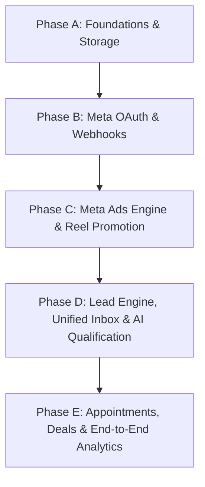

# Car-Pilot Backend: Architecture & Gap Analysis vs. product.md

This document presents a comprehensive review of the codebase against the blueprint defined in [`product.md`](file:///C:/Users/hp/car-pilot-backend/product.md), identifying current implementations, missing modules, architectural gaps, and a structured implementation roadmap.

---

## 1. Executive Summary & Status

The `car-pilot-backend` repository provides the initial scaffolding of an AI-powered Sales & Marketing OS for dealerships.
- **Current State**: Phase A (Core Foundation) is partially implemented with Express, Mongoose schemas, JWT authentication, and basic CRUD for inventory, leads, and mock AI responses.
- **TypeScript Status**: Strict typecheck passes cleanly with 0 compilation errors (`npm run typecheck`).
- **Target MVP Goal**:
  > *Dealer uploads inventory → promotes existing car Reels on Facebook/Instagram → generates enquiries → captures leads → tracks lead conversion.*

---

## 2. Gap Analysis by Product Specification

| Module / Requirement | Status in Codebase | Current Implementation | Missing / Required Enhancements |
| :--- | :---: | :--- | :--- |
| **Multi-Tenancy & RBAC** | ⚠️ Partial | `organizationId` on all models. `requireTenant` middleware. | Fine-grained RBAC permission matrix for team roles. |
| **Authentication** | ⚠️ Partial | Register, Login, `auth/me` with JWT. | Refresh token flow, password reset stubs. |
| **Inventory Management** | ✅ Complete MVP | `InventoryItem` schema, CRUD endpoints, multi-file media upload. | Additional vehicle spec filters if required. |
| **Media & Storage Layer** | ✅ Complete MVP | Local disk storage with static URL serving via Express (`/uploads`). Zero AWS dependency required. | Optional future S3 / R2 remote storage toggle. |
| **Meta Integration (OAuth & Accounts)** | ✅ Complete MVP | `SocialAccount` model with AES-256 encrypted tokens, OAuth callback handler, and sandbox/mock fallback. | Live Facebook App review IDs for production deployment. |
| **Social Reel/Post Publishing** | ✅ Complete MVP | `POST /api/inventory/:id/publish` via Instagram Graph API & Meta integration service. | Optional BullMQ queue orchestration. |
| **Meta Ad Engine (USP)** | ✅ Complete MVP | `POST /api/inventory/:id/promote` (Campaign -> Ad Set -> Creative -> Ad) with daily budget limits. | Performance insights synchronization cron. |
| **Meta Webhooks & Lead Capture** | ✅ Complete MVP | `GET /api/webhooks/meta` (hub challenge) and `POST /api/webhooks/meta` with SHA-256 HMAC verification. | Additional custom webhook event types. |
| **Unified Inbox (Instagram / Facebook)** | ✅ Complete MVP | Auto-creates `Conversation`, `Lead`, and `Message` from incoming Meta events with AI auto-replies. | UI WebSocket connection for real-time human chat. |
| **AI Marketing & Sales Engine** | ✅ Complete MVP | `MockAIService` with copy generation, intent detection, and automated sales replies. | OpenAI / Claude API key integration when ready. |
| **Follow-Up & Async Queues** | ⚠️ Queues Ready | BullMQ installed; next up for sequence timers. | Follow-up job runner. |
| **Analytics & Deals Tracking** | ⚠️ Partial | `Deal`, `Appointment`, and funnel analytics dashboard. | Real Meta Ad spend aggregate sync. |

---

## 3. Structural & Architectural Audit

The current project organizes code as:
```text
src/
├── app.ts
├── server.ts
├── config/
├── controllers/
├── integrations/
│   └── ai/
├── middlewares/
├── models/
├── routes/
└── types/
```

### Alignment with `product.md` Modular Monolith Pattern:
To conform strictly to the architectural standards defined in `product.md`, the following layers and directories should be established:
1. **`services/` & `repositories/`**: Move database queries and business logic out of controllers into a `Controller → Service → Repository → Model` hierarchy.
2. **`integrations/meta/`**:
   - `auth/`: Meta OAuth, token encryption/decryption, token refreshing.
   - `facebook/`: Page management and publishing.
   - `instagram/`: Reels and Instagram media publishing.
   - `ads/`: Marketing API adapter for campaign, ad set, creative, and ad lifecycle.
   - `webhooks/`: Webhook payload verification and event dispatching.
3. **`queues/` & `jobs/`**: Define BullMQ queue instances and dedicated idempotent job worker handlers.
4. **`validators/`**: Input validation schemas using Zod across all routes.
5. **`storage/`**: Pluggable storage adapter supporting local filesystem (development) and AWS S3 (production).

---

## 4. Phased Implementation Plan



### Phase A: Architecture Refactoring & Storage
- [ ] Implement service and repository layers for clean separation of concerns.
- [ ] Implement secure S3 / Local storage adapter for inventory media uploads.
- [ ] Add refresh token support and robust Zod request validators.

### Phase B: Meta Integration & Webhook Ingestion
- [ ] Create `SocialAccount` model with AES-256 token encryption.
- [ ] Implement `MetaIntegrationService` with OAuth handshake and account discovery.
- [ ] Create secure webhook verification endpoints (`GET`/`POST` `/api/webhooks/meta`).
- [ ] Connect BullMQ `meta-webhooks` worker for asynchronous message processing.

### Phase C: Social Publishing & Meta Ad Engine (MVP USP)
- [ ] Implement reel and post publishing to connected Instagram/Facebook pages.
- [ ] Implement `POST /api/inventory/:id/promote` connecting to Meta Marketing API.
- [ ] Implement safety budget bounds (`dailyBudgetLimit`, `organizationBudgetLimit`).

### Phase D: Unified Inbox & AI Sales Agent
- [ ] Normalize incoming Meta messages into `Conversation` and `Message` entities.
- [ ] Implement AI qualification rules and human handoff detection.
- [ ] Implement BullMQ scheduled follow-up sequence engine.

### Phase E: Funnel Analytics & Sales Conversion Tracking
- [ ] Sync Meta Ad insights (`spend`, `clicks`, `cpl`).
- [ ] Track deal lifecycle: `Ad Spend → Lead → Qualified → Test Drive → Won/Sale`.
- [ ] Provide dashboard reporting gross and net ROI per inventory vehicle.
